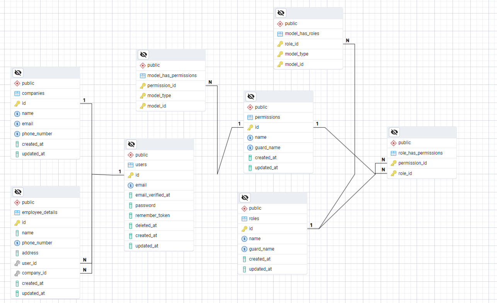

<p align="center"><a href="https://laravel.com" target="_blank"></a></p>

<p align="center">
<a href="https://github.com/laravel/framework/actions"></a>
<a href="https://packagist.org/packages/laravel/framework"></a>
<a href="https://packagist.org/packages/laravel/framework"></a>
<a href="https://packagist.org/packages/laravel/framework"></a>
</p>

## Backed Assesment Paketur

this is the repository of the project from Backend Assessment Paketur



## Project Setup

1. **Dependencies Installation**

   Run and Install dependent packages.
   ```bash
   composer install

2. **Create Database**   
   create db named 'paketur_db' in PostgreSQL or Mysql.


3. Edit .env.example file and rename it to .env
4. Edit .env file and change the database configurations. For example using PostgreSQL:
    ```bash
    DB_CONNECTION=pgsql
    DB_HOST=127.0.0.1
    DB_PORT=5432
    DB_DATABASE=paketur_db
    DB_USERNAME=postgres
    DB_PASSWORD=yudas1337
5. Add Another Environment Variable for JWT Secret Key
     ```bash
    JWT_SECRET=
    JWT_SHOW_BLACKLIST_EXCEPTION=true

6. Change the locale to ID so the validation message and faker data will be in Indonesian.
    ```bash
    APP_LOCALE=id
    APP_FALLBACK_LOCALE=id
    APP_FAKER_LOCALE=id_ID
    ```
7. Add Auth Guard api to .env file
    ```bash
   AUTH_GUARD=api

8. Run this command to generate a new JWT secret key:
    ```bash
   php artisan jwt:secret

9. Run the migration and seeding command:
    ```bash
   php artisan migrate:fresh --seed
    ```
10. Run the server:
    ```bash
    php artisan serve
    ```
11. Run worker so the laravel can dispatch the queue jobs
    ```bash
    php artisan queue:work

12. and open the browser and visit http://localhost:8000 or http://127.0.0.1:8000 . More details in Postman
    Documentation.


13. Run The Test (optional):
    ```bash
    php artisan test

## API Postman Documentation

for API and Endpoint Documentation can be accesed here:
https://documenter.getpostman.com/view/8729842/2sAYBREt5T

## Validation Rules Explaination

In this documentation, i will just explain the most important validation. So, the another request with similar and same
functionality will not be explained again.

1. StoreCompanyRequest

    ```bash
    return [
            'name' => ['required', 'max:150', Rule::unique('companies')->ignore($this->company)],
            'email' => ['required', 'email', 'max:100', Rule::unique('companies')->ignore($this->company)],
            'phone_number' => ['required', 'string', 'max:50', Rule::unique('companies')->ignore($this->company)],
        ];
    ```
   Detail Explanation:
    * Name:
        * Required: Cannot be Null
        * Max(150): maximize the character so it will not trigger database error if the data is too long.
        * Unique: the Company name will not be duplicated.
        * Ignore: This is for further validation, if the company can be updated, it will ignore the current property id
          using laravel dependency injection
          from given company parameter. So if the value from ignore method is null, it will ignore nothing.
    * Email:
        * Email: the email must be valid email format. for examle: johndoe@gmail.com, must have @ symbol or etherwise it
          will not be valid.


2. UpdateManagerRequest

    ```bash
     return [
            'email' => ['required', 'email', 'max:100', Rule::unique('users')->ignore(auth()->id())],
            'name' => ['required', 'max:150'],
            'password' => ['required', 'min:8'],
            'phone_number' => ['required', 'max:50', Rule::unique('employee_details')->ignore(auth()->id(), 'user_id')],
            'address' => ['required']
        ];
    ```
   Detail Explanation:
    * Password:
        * Mininum 8: Standart Minimum password at least 8 characters
    * Email:
        * Unique: the email must not be duplicated from users table.
        * Ignore : And will ignore the validation from current user id (From Authentication Session)
    * Phone Number:
        * Unique: the phone number must not be duplicated from employee_details table.
        * Ignore : And will ignore the validation from current user id (From Authentication Session) and the column name
          is user_id


3. EmployeeRequest
    ```bash
     return [
            'email' => ['required', 'email', 'max:100', Rule::unique('users')->ignore($this->employee)],
            'name' => ['required', 'max:150'],
            'password' => ['required', 'min:8'],
            'phone_number' => ['required', 'max:50', Rule::unique('employee_details')->ignore($this->employee?->id, 'user_id')],
            'address' => ['required'],
            'company_id' => [
                'required',
                Rule::exists('companies', 'id')->where(function ($query) {
                    $query->where('id', auth()->user()->employeeDetail->company_id);
                })
            ],
        ];
    ```
   Detail Explanation:
    * Company Id:
        * Exists: the company id must be exist in companies table and column id. Then, the provided id must be equal to
          the current user auth session company id. Because, we assume that the user or the manager can only create
          employee from the same company.

## Third Party Libraries

- [Spatie, Laravel Permissions](https://spatie.be/docs/laravel-permission/v6/installation-laravel). For managing user
  roles and permissions.
- [JwtAuth, tymon/jwt-auth](https://github.com/tymondesigns/jwt-auth). For Creating and Managing JWT Tokens.


